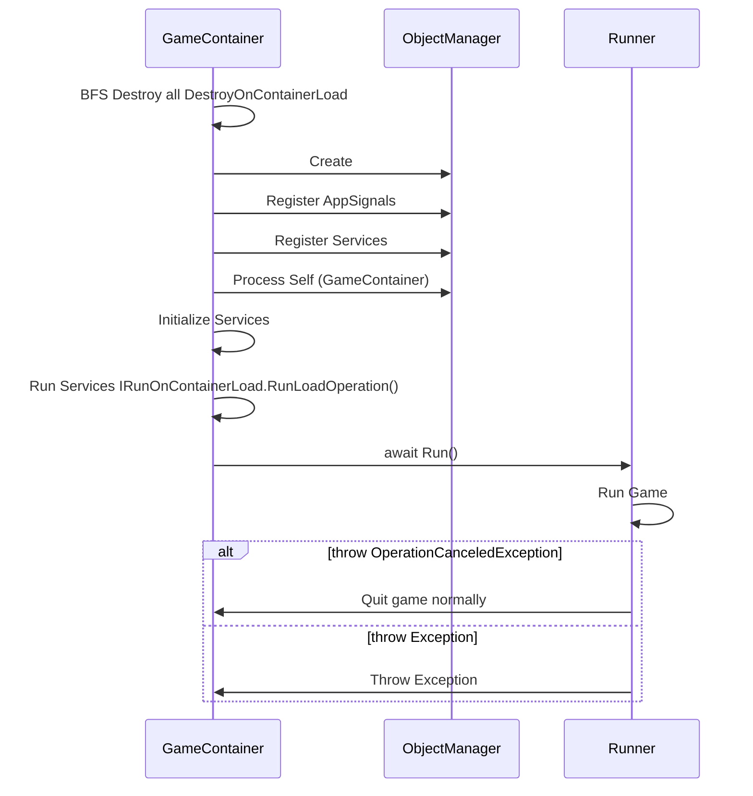

```mermaid
sequenceDiagram
    participant G as GameContainer
    participant O as ObjectManager
    participant R as Runner
    G->>G: BFS Destroy all DestroyOnContainerLoad
    G->>O: Create
    G->>O: Register AppSignals
    G->>O: Register Services
    G->>O: Process Self (GameContainer)
    G->>G: Initialize Services
    G->>G: Run Services IRunOnContainerLoad.RunLoadOperation()
    G->>R: await Run()
    R->>R: Run Game
    alt throw OperationCanceledException
        R->>G: Quit game normally
    else throw Exception
        R->>G: Throw Exception
    end
```